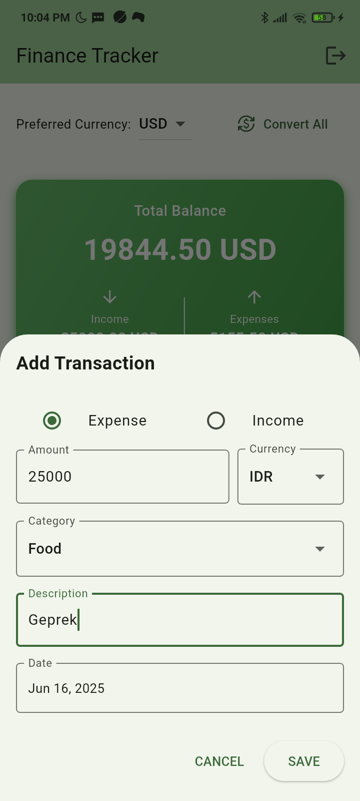

# Piggy Bank - Finance Tracker
A comprehensive personal finance management application built with Flutter and Firebase to help users effectively manage and track their financial activities. Take control of the money with intuitive expense tracking, budget planning, savings goal, and debt management.

<br>

## Group 4
| **Name** | **NRP** |
| --- | --- |
| **Iffa Amalia Sabrina** | 5025221077 |
| **Hasnain Pyarali** | 5999241025 |
| **Ange, Simon, Axel, Duhayon** | 5999241027 |
<br>

## Application Overview
Piggy Bank - Finance Tracker is a modern mobile application designed to provide users with complete financial oversight and control. Whether you are tracking daily expenses, planning budgets, saving for goals, or managing debts, this app offers all the tools that user usually need in one convenient location.

## Core Features
1. Authentication System
- Secure Login
- User Registration
- Firebase Authentication
2. Income & Expense (Transactions) Tracking
- Transaction Management: Add, edit, delete the records
- Category Organization: Food, Transportation, Housing, etc for expense and Salary, Investment, etc for income
- Multi-Currency Support
- Real-time Balance
- Transaction History
3. Budget Goals
- Expense Budget: Set, edit, and delete budget
- See Transaction under Specific Category
- Real-time Balance (Percentage and Total)
4. Saving Module
_This feature is currently in development_
5. Debt Tracking
- Debt Management: Set, edit, and delete debt
- Credit Tracking: Set, edit, and delete credit
- Debtor information
- Debt overview

## Screenshots
<!-- Login & Sign Up -->
1. Login page <br>

2. Sign up or register page <br>

<!-- Income & Expense (Transaction) -->
3. Transaction page <br>

4. Create transaction <br>

5. Edit transaction <br>

6. Delete transaction <br>

<!-- Budget Goals -->
7. Budget page <br>

8. Set a budget goal <br>

9. Edit budget goals <br>

10. Delete budget goals <br>

<!-- Debt -->
11. Debt page <br>

12. Add debt or credit <br>

13. Edit debt <br>

14. Delete debt <br>


## Technical Architecture
### Technology Stack
- Frontend: Flutter (Dart)
- Backend: Firebase Firestore (Cloud Database)
- AUthentication: Firebase Auth
- Currency API: ExchangeRate-API
## Key Dependencies
```
dependencies:
  flutter:
    sdk: flutter
  cupertino_icons: ^1.0.8
  firebase_core: ^3.13.1
  firebase_auth: ^5.5.4
  intl: ^0.20.2
  cloud_firestore: ^5.6.8
  http: ^1.4.0
```

## Team Contribution
1. Iffa Amalia Sabrina (5025221077)
- Set up Firebase project, Firebase Auth, and Firestore database
- Designed and implemented authentication system (login/signup pages)
- Developed comprehensive transaction CRUD operations with real-time updates
- Implemented budget goals management system with progress tracking
- Integrated real-time currency conversion API with Firebase service
2. Hasnain Pyarali (5999241025)
- Developed savings goals tracking system
- Created savings CRUD operations and data management
- Implemented savings progress visualization
- Contributed to application testing and quality assurance
3. Ange, Simon, Axel, Duhayon (5999241027)
- Developed complete debt tracking functionality with CRUD operations
- Created debt vs credit management system with detailed records
- Implemented launcher icons and application branding
- Designed application logo and visual identity